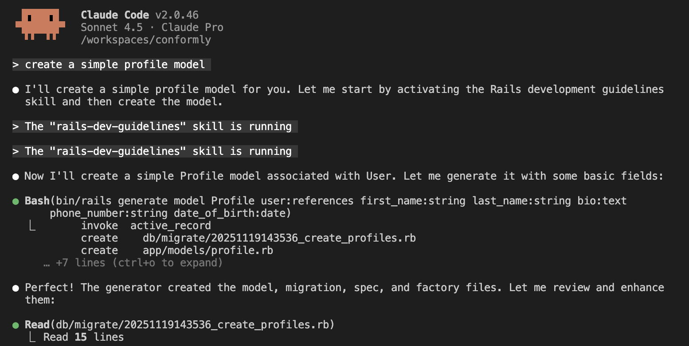

# Claude Code Infrastructure for Ruby on Rails

> Rails-specific skills, agents, and dev docs that make Claude Code a Rails expert.

[](https://rubyonrails.org/)
[](https://claude.ai/code)
[](https://opensource.org/licenses/MIT)

## What This Does

Transforms Claude Code into a Rails-native development partner with:

- **Rails-Specific Skills**: MVC patterns, ActiveRecord, testing, security, Hotwire
- **Specialized Agents**: Code review, refactoring, test debugging
- **Persistent Dev Docs**: Documentation that survives context resets
- **Smart Patterns**: Service objects, query objects, N+1 detection, and more

Instead of generic AI advice, you get Rails best practices automatically.



## Acknowledgments

💙 This infrastructure entirely is inspired by and adapted from: **[diet103/claude-code-infrastructure-showcase](https://github.com/diet103/claude-code-infrastructure-showcase)**

Thank you to **diet103** for pioneering this approach!

## Quick Start

### 1. Install

```bash
# Copy to your Rails project
cd your-rails-app
git clone https://github.com/YOUR_USERNAME/rails-claude-infrastructure.git temp
cp -r temp/.claude .

# Make hooks executable
chmod +x .claude/hooks/*.sh .claude/hooks/*.js
```

### 2. Add to CLAUDE.md

```markdown
## Skills Available

Use these skills for context-specific guidance:
- `/skill rails-dev-guidelines` - Models, controllers, services
- `/skill rspec-testing-guidelines` - Testing patterns

See `.claude/README.md` for details.
```

### 3. Use It

```bash
# Activate a skill before working
/skill rails-dev-guidelines

# Then ask Claude anything
Create a User model with validations and associations
```

That's it! Claude now follows Rails best practices.

## What's Included

### 🎯 2 Rails Skills

| Skill | Use For |
|-------|---------|
| `rails-dev-guidelines` | Models, controllers, services, queries |
| `rspec-testing-guidelines` | Tests, factories, mocking, coverage |

Each skill includes:
- Quick reference guide
- Code examples (❌ wrong vs ✅ right)
- Detailed resource files
- Anti-patterns to avoid

### 🤖 Three Specialized Agents

**Rails Code Reviewer**
```bash
# Reviews your code against Rails best practices
"Review the code I just wrote"
```

**Refactoring Planner**
```bash
# Plans safe, incremental refactoring
"This controller is too fat, help refactor it"
```

**RSpec Test Fixer**
```bash
# Debugs and fixes failing tests
"I have failing specs, help me fix them"
```


### Add Your Own Skill

```bash
# 1. Create directory
mkdir -p .claude/skills/my-skill/resources

# 2. Create SKILL.md
cat > .claude/skills/my-skill/SKILL.md << 'EOF'
---
name: my-skill
description: My team's patterns
---

# My Skill

## When to Use
[Your scenarios]

## Core Patterns
[Your patterns with examples]
EOF

# 3. Add to skill-rules.json
# Edit .claude/skills/skill-rules.json
```

## Contributing

Contributions welcome! To contribute:

1. Fork the repository
2. Create your feature branch
3. Test thoroughly
4. Submit a pull request

## License

MIT License - Free for personal and commercial use.

See LICENSE file for details.

## Support

- **Issues**: Open a GitHub issue
- **Discussions**: Use GitHub Discussions
- **Documentation**: See `.claude/README.md` for detailed docs

---

**Built for the Rails community** | **Star if useful!** ⭐
